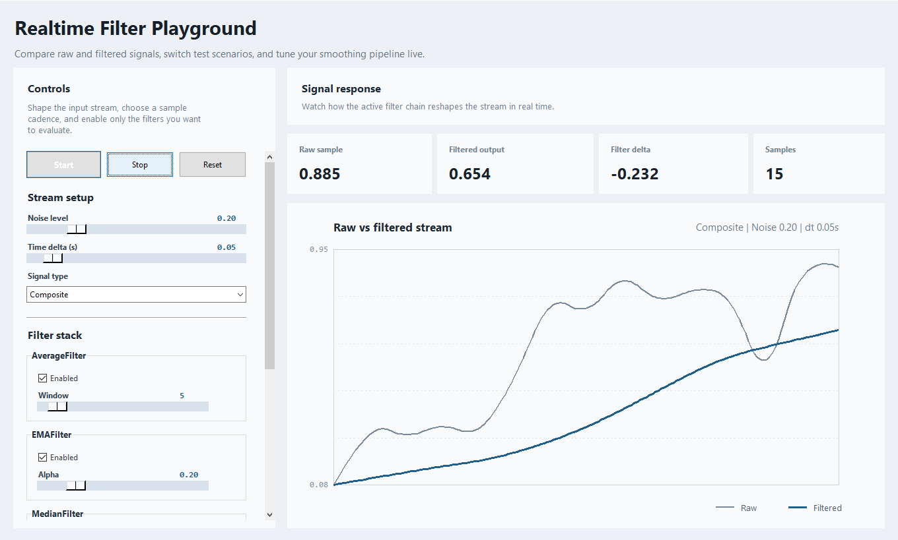

# realtime-filter-pipeline

Composable real-time filters for smoothing, derivative estimation, and online signal processing in robotics, controls, sensors, and vision systems.

## Why this exists

Real-world signals are noisy. Encoder values jump, brightness measurements drift, derivative estimates amplify noise, and raw sensor streams are often too unstable to use directly in a control loop or vision pipeline.

This package provides small, reusable streaming filters that operate one sample at a time and can be chained together into a processing pipeline.

## Features

- Streaming filters for online, sample-by-sample processing
- Composable `FilterPipeline` for chaining filters
- Smoothing filters for noisy sensor data
- Derivative estimation for velocity, acceleration, and jerk
- Shared aggregation-based implementation for simple windowed filters
- Lightweight Python package structure under `src/`

## Installation

```bash
pip install -r requirements.txt
```

or for editable development install:

```bash
pip install -e .
```

Dependencies:

- `numpy`

## Quick start

```python
from realtime_filter_pipeline import EMAFilter, FilterPipeline, MedianFilter

pipeline = FilterPipeline([
    MedianFilter(window_size=3),
    EMAFilter(alpha=0.2),
])

for sample in [10, 12, 80, 13, 12]:
    print(pipeline.update(sample))
```

## Interactive playground

The repo includes a simple desktop UI for testing filters on a simulated live data stream.



It provides:

- a `Start` button to begin the stream
- a `Stop` button to pause it and a `Reset` button to restart it
- configurable noise level
- configurable `time delta` to control sample/update rate
- signal selection for `Composite`, `Sine`, `Step`, `Ramp`, and `Spikes`
- filter enable/disable toggles
- parameter controls for each filter
- a scrollable filter control area so the full control panel fits in smaller windows
- a dashboard-style layout with live metric cards and a plot panel
- live raw-vs-filtered graph
- current raw, filtered, and delta values

Run it with:

```bash
python -m realtime_filter_pipeline.examples.playground
```

or after editable install:

```bash
rtfp-playground
```

It is useful for quickly checking:

- how each filter reacts to different noise levels
- how filters behave on smooth, stepped, ramped, and spiky data
- how parameter changes affect lag, smoothing strength, and responsiveness
- how the filter stack feels under different sample/update rates

## Filter guide

This section explains what each filter does, when it helps, and how its parameters change its behavior.

### `AverageFilter`

What it does:
- Computes the simple moving average of the current sliding window.
- Smooths random noise by averaging recent samples.

Implementation note:
- This filter is a thin wrapper around `WindowedAggregationFilter` using `numpy.mean`.

When to use it:
- You want a basic baseline smoother.
- Noise is mild and you do not need sharp event preservation.

Main parameter:
- `window_size`

How `window_size` changes behavior:
- Larger `window_size`:
  - smoother output
  - more delay
  - slower response to real changes
- Smaller `window_size`:
  - faster response
  - less smoothing
  - more visible noise

### `MedianFilter`

What it does:
- Returns the median of the current window instead of the mean.
- Rejects spikes much better than linear smoothers.

Implementation note:
- This filter is a thin wrapper around `WindowedAggregationFilter` using `numpy.median`.

When to use it:
- You have impulse noise or occasional outliers.
- You want to preserve edges better than an average filter would.

Main parameter:
- `window_size`

How `window_size` changes behavior:
- Larger `window_size`:
  - stronger outlier rejection
  - more delay
  - can flatten short valid events
- Smaller `window_size`:
  - faster response
  - weaker protection from bursts and spikes

### `ModeFilter`

What it does:
- Returns the most common value in the current window.
- Best suited to repeated, quantized, or discrete-valued signals.

Implementation note:
- This filter is a thin wrapper around `WindowedAggregationFilter` using a mode aggregation helper.

When to use it:
- Your signal takes repeated categories or discrete states.
- You want short incorrect states to be suppressed.

Main parameter:
- `window_size`

How `window_size` changes behavior:
- Larger `window_size`:
  - more stable state output
  - slower transition to a new dominant value
- Smaller `window_size`:
  - faster switching
  - more sensitive to short-lived state noise

### `WindowedAggregationFilter`

What it does:
- Applies a single aggregation function over the current sliding window.
- Provides the common implementation for simple aggregation-based filters.

When to use it:
- You want to create a custom windowed filter without rewriting buffer logic.
- You need a custom aggregate like `min`, `max`, `range`, or a domain-specific statistic.

Main parameters:
- `aggregator`
- `window_size`

How `aggregator` changes behavior:
- The output is fully determined by the function you pass in.
- Examples:
  - `numpy.mean` gives average smoothing
  - `numpy.median` gives spike-robust smoothing
  - `max` gives a sliding maximum

### `EMAFilter`

What it does:
- Applies exponential smoothing, giving more weight to recent samples.
- Uses memory of the full past signal, but recent values matter most.

When to use it:
- You want low-cost smoothing with less memory than a large moving window.
- You need a good general-purpose smoother for live sensor values.

Main parameter:
- `alpha`

How `alpha` changes behavior:
- Larger `alpha`:
  - follows new samples more quickly
  - less smoothing
  - more sensitive to noise
- Smaller `alpha`:
  - smoother output
  - more lag
  - slower recovery after changes

### `GaussianFilter`

What it does:
- Smooths using a Gaussian-shaped window.
- Gives the highest weight to samples near the center of the window.

When to use it:
- You want smoother behavior than a box average.
- You want central samples to matter more than edge samples.

Main parameters:
- `window_size`
- `std_dev`

How `window_size` changes behavior:
- Larger `window_size`:
  - more smoothing
  - more delay
  - broader temporal context

How `std_dev` changes behavior:
- Smaller `std_dev`:
  - sharper weighting near the center
  - less contribution from outer samples
  - more local response
- Larger `std_dev`:
  - flatter weighting across the window
  - behavior moves closer to a wider average

### `LowPassFilter`

What it does:
- Applies a custom weighted kernel to the sliding window.
- Lets you define your own FIR-style smoothing behavior.

When to use it:
- You want full control over the window weights.
- You already know the weighting shape you want.

Main parameters:
- `window_size`
- `kernel`

How `kernel` changes behavior:
- Heavier center weights:
  - stronger emphasis on recent or middle samples
  - less influence from extremes
- Uniform weights:
  - behaves like a moving average
- Custom asymmetric weights:
  - can bias the filter toward newer samples

### `SavitzkyGolayFilter`

What it does:
- Fits a low-order polynomial over the current window and uses it for smoothing.
- Preserves local shape better than a simple average.

When to use it:
- You want smoothing without flattening peaks and local trends too much.
- You care about preserving waveform shape.

Main parameters:
- `window_size`
- `poly_order`

How `window_size` changes behavior:
- Larger `window_size`:
  - stronger smoothing
  - more lag
  - broader local fit

How `poly_order` changes behavior:
- Lower `poly_order`:
  - smoother and simpler fit
  - can flatten more structure
- Higher `poly_order`:
  - follows local shape more closely
  - can become more sensitive to noise

### `DerivativeFilter`

What it does:
- Estimates derivatives from streaming data using finite differences.
- Supports:
  - first derivative: velocity / slope
  - second derivative: acceleration / curvature
  - third derivative: jerk

When to use it:
- You need rate-of-change information from sampled data.
- You are building motion, control, or trend analysis pipelines.

Main parameters:
- `window_size`
- `dt`
- `derivative_order`
- `smooth_window`
- `use_dynamic_time`

How `derivative_order` changes behavior:
- `1`:
  - first derivative
  - most practical and least noisy
- `2`:
  - second derivative
  - more noise-sensitive
- `3`:
  - third derivative
  - very noise-sensitive

How `dt` changes behavior:
- Larger `dt`:
  - smaller derivative magnitude for the same sample change
- Smaller `dt`:
  - larger derivative magnitude

How `smooth_window` changes behavior:
- Larger `smooth_window`:
  - cleaner derivative output
  - more lag
- Smaller `smooth_window` or `None`:
  - more responsive
  - noisier

How `use_dynamic_time` changes behavior:
- `False`:
  - assumes constant sample spacing
- `True`:
  - uses actual timestamps
  - better for irregular sampling

### `FilterPipeline`

What it does:
- Chains multiple filters in sequence.
- The output of one filter becomes the input of the next.

When to use it:
- You want a realistic processing chain rather than one standalone filter.

## Choosing a filter

Use:
- `AverageFilter` for the simplest baseline smoother
- `EMAFilter` for a practical real-time default
- `MedianFilter` when spikes are the main problem
- `GaussianFilter` when you want softer window weighting
- `LowPassFilter` when you want custom weights
- `SavitzkyGolayFilter` when preserving local shape matters
- `DerivativeFilter` when you need slope, acceleration, or jerk
- `FilterPipeline` when one filter is not enough
- `WindowedAggregationFilter` when you want to define a custom aggregation-based windowed filter

## Typical use cases

- Sensor smoothing in robotics and automation
- Brightness and telemetry stabilization in vision systems
- Online derivative estimation for control loops
- Streaming preprocessing before thresholding, monitoring, or anomaly detection

## Project structure

```text
realtime-filter-pipeline/
  src/realtime_filter_pipeline/
    core/
    smoothing/
    derivatives/
    pipeline/
  tests/
  pyproject.toml
  README.md
```

Layout notes:

- `core/` contains shared abstractions and reusable helpers
- `smoothing/` contains windowed and smoothing-oriented filters
- `derivatives/` contains derivative estimation filters
- `pipeline/` contains composition helpers

## Development

Run tests with:

```bash
PYTHONPATH=src python -m unittest discover tests
```

On Windows PowerShell:

```powershell
$env:PYTHONPATH="src"
python -m unittest discover tests
```

## Status

This is a lightweight practical library aimed at real-time numeric filtering workflows. It is a good fit for engineering projects that need simple, composable filters without a large framework.
